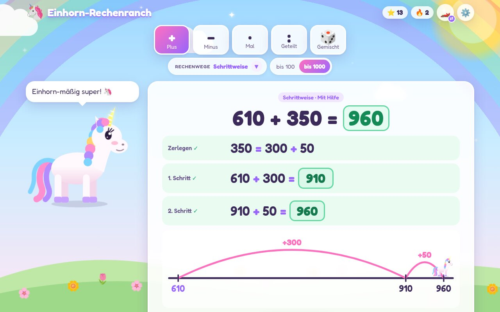
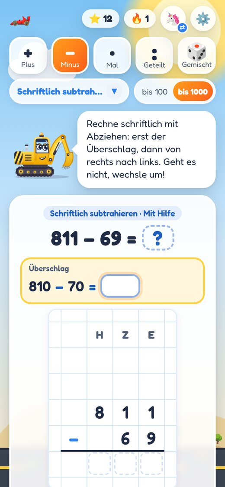

# 🦄 Einhorn-Rechenranch

**Halbschriftlich und schriftlich rechnen üben: 3. Klasse, Zahlenraum bis 1000, mit Einhörnern oder Baggern.**

### [▶ App öffnen: tboehm.github.io/math-learning-for-kids](https://tboehm.github.io/math-learning-for-kids/)

Kostenlos · ohne Anmeldung · ohne Tracking · läuft im Browser auf Handy, Tablet und PC

  
  

## Worum es geht

Entstanden ist die App am Küchentisch: Am nächsten Tag stand eine Mathearbeit an, Lust auf Üben gab es null, und die
üblichen Lern-Apps waren „öde“. Der Wunsch der Tochter: *„Es muss was mit Einhörnern sein.“*

Herausgekommen ist eine App, die genau die Rechenwege übt, die in der 3. Klasse dran sind – **Zeile für Zeile wie
im Heft**. Das Kind schreibt seine Zwischenschritte selbst, jede Zeile wird sofort geprüft, und ein Begleiter
hilft in Stufen weiter. Dabei zählt **jeder richtige Weg**, nicht nur die Musterlösung: Wer erst die Einer rechnet
oder in drei statt zwei Sprüngen ans Ziel kommt, bekommt trotzdem seinen Stern.

## Was die App kann

- **Plus, Minus, Mal, Geteilt** im Zahlenraum bis 1000 – oder bis 100 zur Wiederholung, umschaltbar direkt über der Aufgabe.
- **Halbschriftliche Rechenwege:** Stellenweise, Schrittweise, Hilfsaufgabe, Vereinfachen, Ergänzen, Zerlegen,
  Kernaufgaben – mit Rechenstrich, Malkreuz, Punktefeld und Zerlegungsbaum zum Anschauen.
- **Schriftlich addieren und subtrahieren** (Abziehen mit Umwechseln oder Ergänzen) im Rechenraster auf Karopapier,
  mit Überschlag, Vergleich und Probe.
- **Knobeln:** Zahlenmauern, Fehler finden, „Welcher Weg ist geschickt?“ und Überschlagen.
- **Drei Hilfe-Stufen:** *Mit Hilfe* (Schritte vorgegeben), *Zerlegung selbst* und *Alles selbst* – so wie in der Arbeit.
- **Hilfe, die nicht schimpft:** erst Ermutigung, dann ein Tipp, beim dritten Versuch die Lösung.
- **Zwei Welten:** die Einhorn-Ranch 🦄 und die Turbo-Rechenwerkstatt 🏎️ mit Baggern, Rennautos und Feuerwehr.
- **Belohnungen:** Sterne, Serien, eine Galopp-Parade und neue Begleiter zum Freischalten.
- **Für jedes Gerät:** Auf Tablets und Handys gibt es ein großes Zahlenfeld, die Tastatur bleibt zu.

## So geht's los

1. [App öffnen](https://tboehm.github.io/math-learning-for-kids/), Namen eingeben, Welt und Begleiter wählen.
2. Oben die **Rechenart** antippen, darunter im Menü den **Rechenweg** und daneben den **Zahlenraum** wählen.
3. Über ⚙️ lassen sich **Hilfe-Stufe**, Zehnerübergang (ohne / gemischt / mit), Geteilt mit Rest, Töne und Zahlenfeld einstellen.

**Tipp für Eltern:** Neue Rechenwege mit *Mit Hilfe* beginnen, dann *Zerlegung selbst*, Ziel ist *Alles selbst*.
Auf dem Tablet lässt sich die Seite über „Zum Home-Bildschirm“ wie eine App ablegen.

<b>Alle Rechenwege und Knobeleien im Detail</b>

| Rechenart | Rechenwege | Anschauung |
|---|---|---|
| **+** Plus | Stellenweise (H+H, Z+Z, E+E – Reihenfolge frei) · Schrittweise (346 + 200 + 20 + 8) · Hilfsaufgabe (59 + 19 → 60 + 19 − 1) · Vereinfachen (239 + 41 = 240 + 40) | Rechenstrich |
| **−** Minus | Schrittweise · Ergänzen bei nahen Zahlen (590 → 600 → 900 → 930) · Hilfsaufgabe (82 − 39 → 82 − 40 + 1) · Vereinfachen (73 − 29 = 74 − 30) | Rechenstrich |
| **·** Mal | Zerlegen (4 · 23 = 4 · 20 + 4 · 3) · Kernaufgaben mit 1 ·, 2 ·, 5 ·, 10 · (7 · 8 = 5 · 8 + 2 · 8) · Hilfsaufgabe (9 · 15 = 10 · 15 − 15) | Malkreuz, Punktefeld |
| **:** Geteilt | Zerlegen in leichte Teile (852 : 4 = 800 : 4 + 40 : 4 + 12 : 4), Probe mit der Malaufgabe, optional mit Rest | Zerlegungsbaum |
| **Schriftlich** | Addieren (auch drei Zahlen) · Subtrahieren durch Abziehen mit Umwechseln (auch 1000 − 374) · Subtrahieren durch Ergänzen · jeweils mit Überschlag, Vergleich und bei Minus Probe | Rechenraster (H \| Z \| E) |

| Knobelei | Rechenarten | So geht's |
|---|---|---|
| **Zahlenmauer** | + − | Jeder Stein ist die Summe der zwei Steine darunter – nach oben rechnen oder fehlende Steine finden. |
| **Fehler finden** | + − · : | In einer fertigen Rechnung steckt ein typischer Fehler (Zehnerübergang vergessen, verzählt, Null vergessen …). Finden und verbessern. |
| **Welcher Weg?** | + − | Welcher Rechenweg ist hier geschickt? (328 + 99 → Hilfsaufgabe, 702 − 698 → Ergänzen) Danach wird mit dem gewählten Weg gerechnet. |
| **Überschlagen** | + − · | Grob rechnen, genau rechnen, vergleichen: Passt das Ergebnis zum Überschlag? |

Jede Aufgabe wird zufällig neu erzeugt, die Knobeleien halten sich an den eingestellten Zahlenraum.

## Datenschutz – auch für die Schule

- **Keine Anmeldung, keine Cookies, keine Tracker**, keine Analyse- oder Werbedienste.
- **Nichts von fremden Servern:** Schrift und Bilder liegen im Projekt, Grafiken sind SVG im Code, Klänge entstehen
  live im Browser.
- **Fortschritt bleibt auf dem Gerät:** Name, Sterne und Einstellungen stehen nur im `localStorage` des Browsers.
  Wer die Browserdaten löscht, setzt die App zurück.
- **Hosting:** Die öffentliche Version liegt auf GitHub Pages; GitHub verarbeitet dabei als Hoster die technisch
  nötigen Zugriffsdaten. Wer das vermeiden will, kann die App selbst hosten oder ganz offline nutzen (siehe unten).
- Der einzige Link nach außen ist der kleine Chip „Agentic Engineering for Teams“ am Rand; er lädt nichts nach und
  öffnet sich nur, wenn man ihn antippt.

## Selbst hosten oder offline nutzen

Die App besteht nur aus statischen Dateien, ohne Build-Schritt und ohne Server-Logik.

- **Offline:** [Repository als ZIP herunterladen](https://github.com/tboehm/math-learning-for-kids/archive/refs/heads/main.zip),
  entpacken, `index.html` öffnen.
- **Eigener Webserver / Schulserver:** den Ordner einfach hochkopieren.
- **Eigene GitHub-Pages-Version:** Repository forken und unter *Settings → Pages* „Deploy from a branch → `main`“ wählen.

Bei einer eigenen Version bitte das Porträtfoto `img/tobias-boehm.jpg` entfernen oder ersetzen (siehe [Lizenz](#lizenz)).

## Wie die App entstanden ist

Die erste Version stand nach etwa 30 Minuten – gebaut mit [Claude Code](https://claude.com/claude-code) im Stil des
*Agentic Engineering*: Der Mensch beschreibt, was Kinder brauchen, und prüft das Ergebnis; ein KI-Agent schreibt Code
und Tests. Seitdem ist die App Wunsch für Wunsch gewachsen.

Damit dabei verlässliche Software herauskommt, gelten feste Leitplanken (nachzulesen in [`CLAUDE.md`](CLAUDE.md)):
testgetriebene Entwicklung, jede richtige Alternative muss angenommen werden, und alles Prüfbare wird als schneller
Unit-Test geprüft. Die Tests erzeugen zehntausende Zufallsaufgaben und kontrollieren jede Zeile; Browser-Tests prüfen
die Oberfläche auf Handy, Tablet und Desktop. Jeder Push läuft durch die CI, bevor er live geht.

Wie man so etwas im eigenen Team aufsetzt, zeige ich im Workshop
**[Agentic Engineering for Teams](https://toboehm.de/agentic-engineering)**.

## Mitmachen

Fehler gefunden, Idee für eine Knobelei oder einen Rechenweg? Gern als
[Issue](https://github.com/tboehm/math-learning-for-kids/issues) melden. Wie das Projekt aufgebaut ist, wie man es
lokal startet und testet, steht in [`CONTRIBUTING.md`](CONTRIBUTING.md).

## Lizenz

Der Code steht unter der [MIT-Lizenz](LICENSE) – nutzen, verändern und weitergeben ausdrücklich erwünscht, auch in
Schulen. Ausgenommen sind:

- die Schrift **Fredoka** – [SIL Open Font License 1.1](fonts/OFL.txt),
- das **Porträtfoto** `img/tobias-boehm.jpg` – alle Rechte vorbehalten.

Details zu allen fremden Bestandteilen: [`THIRD-PARTY-NOTICES.md`](THIRD-PARTY-NOTICES.md).

© 2026 Tobias Boehm
